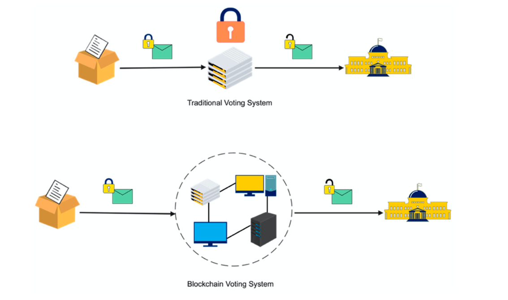
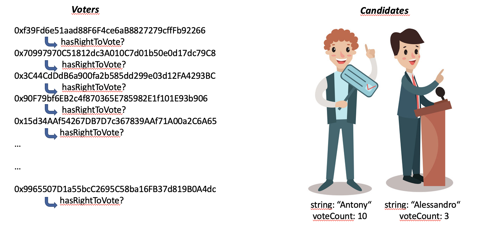
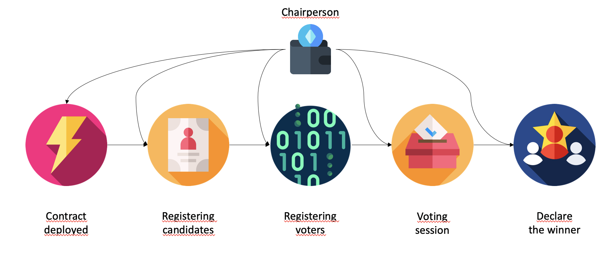
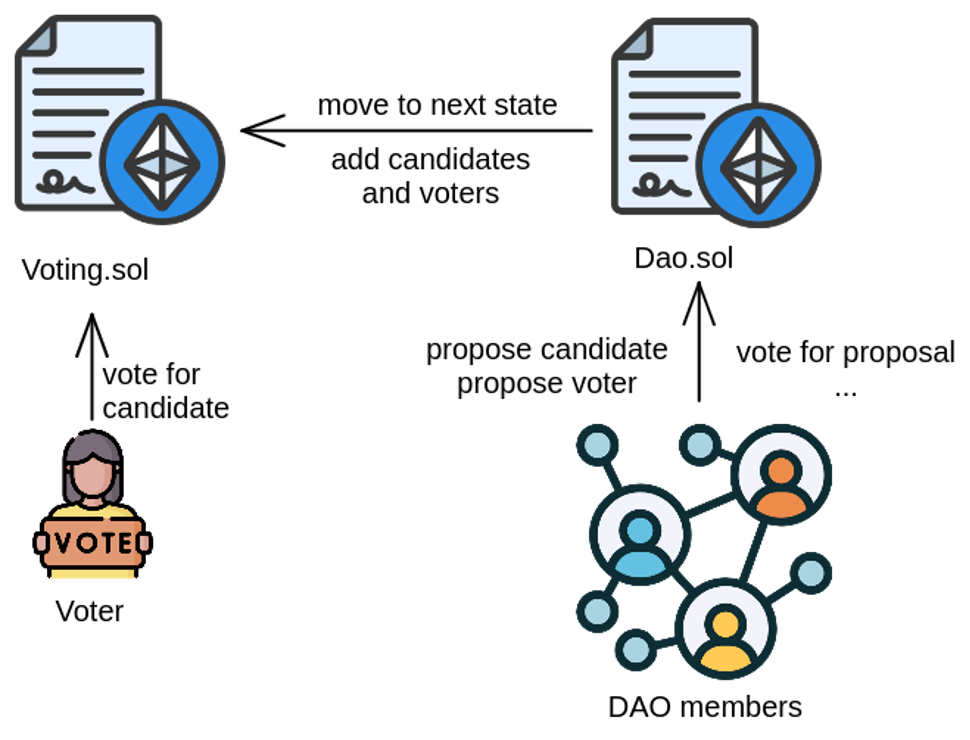
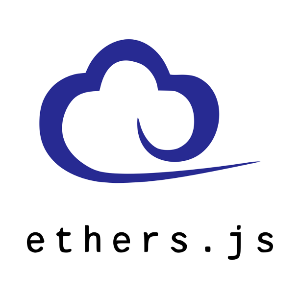

# Blockchain eVoting System

## Introduction

This project explores a decentralized, blockchain-based eVoting system aimed at improving the security, transparency, and efficiency of voting processes. Traditional eVoting systems are typically based on a centralized client-server architecture, making them vulnerable to hacking and tampering at a single point of failure. By leveraging the power of blockchain technology, we can distribute trust across a network, ensuring that altering records becomes practically impossible without overwhelming the entire network (cracking 51% of nodes simultaneously).

---

## Why an eVoting System?

eVoting systems offer numerous advantages:

- **Reduced Effort:** Streamlines the process of preparing and managing a poll.
- **Cost Efficiency:** Reduces the financial burden compared to traditional voting methods.
- **Enhanced Voter Experience:** Simplifies the voting process, making it more accessible.
- **Health & Environmental Benefits:** Eliminates paper usage, reducing environmental impact and supporting social distancing when necessary.

Blockchain technology further amplifies these benefits by providing a decentralized and tamper-proof mechanism. The probability of record alteration is near zero, enhancing trust in the system.

---

## Smart Contract: Voting.sol

The `Voting.sol` smart contract, written in Solidity, handles the core functionality needed to run an election on the Ethereum blockchain. The contract introduces two key entities:

- **Voter**: Identified by an address and a flag indicating if they have the right to vote.
- **Candidate**: Identified by an address and a counter tracking the number of votes received.

### State Management

We use Solidity's modifiers to manage the different phases of the election. The process follows a structured pipeline:

1. **Deployment**: The `Voting.sol` contract is deployed to the network.
2. **Registration**: Candidates and voters are registered.
3. **Voting Phase**: Voting begins, and eligible voters cast their ballots.
4. **Result Calculation**: The votes are tallied, and the winner is determined.

This phased approach ensures the integrity and order of the election process.

---

## Decentralized Autonomous Organization (DAO)

In our system, the "chairperson" manages state transitions in `Voting.sol`. To decentralize this authority, we introduce a **DAO: Decentralized Autonomous Organization**.

The DAO is implemented using a separate smart contract, `Dao.sol`, which acts as the owner of `Voting.sol`. Members of the DAO have various responsibilities:

- **Proposals**: Members can propose adding or removing voters and candidates.
- **Voting on Proposals**: Members can vote on these proposals, enabling a democratic decision-making process.
- **State Transitions**: Members can also propose and vote on moving to the next state of the election.

Proposals remain open for a set period before being closed and acted upon.

This architecture ensures that decision-making is distributed and transparent, reducing the risk of centralization.

---

## Tech Stack

Our system is built using the following technologies:

|  |  |
| ---------------------------------------------------------- | ---------------------------------------------------------- |
|       |  |

### Hardhat

We use **Hardhat** for local deployment of our smart contracts. Hardhat provides a robust environment for:

- Deploying contracts locally.
- Running tests and debugging Solidity code.
- Simulating a blockchain network that external clients (like Metamask or front-end applications) can interact with.

Hardhat makes the development cycle smoother by abstracting complex interactions with the Ethereum network.

---

## Web Interface for Our DApp

Our decentralized application (DApp) features a user-friendly web interface developed using **React.js** and **Metamask** for blockchain interactions. Here’s how we structured our frontend:

- **Ethers.js**: Used for seamless communication between the web interface and the smart contract deployed on Hardhat's local network.
- **Bootstrap**: Utilized to create an elegant and responsive user interface.

This combination of technologies ensures a smooth user experience and robust integration with our blockchain backend.

---

## Future Work

While our eVoting system provides a solid foundation, there are areas for enhancement:

- **Anonymity**: Currently, voter addresses are not hidden, posing a privacy concern. To achieve true anonymity, we could integrate **zero-knowledge proofs (ZKP)**. With ZKP, a user can prove they have a voting key without revealing any additional information. This approach is used by systems like Open Vote Network, where a voter's submission includes both their voting key and a ZKP.

Implementing ZKP would make our eVoting system more secure and privacy-preserving, ensuring that votes remain anonymous while still being verifiable on the blockchain.

---